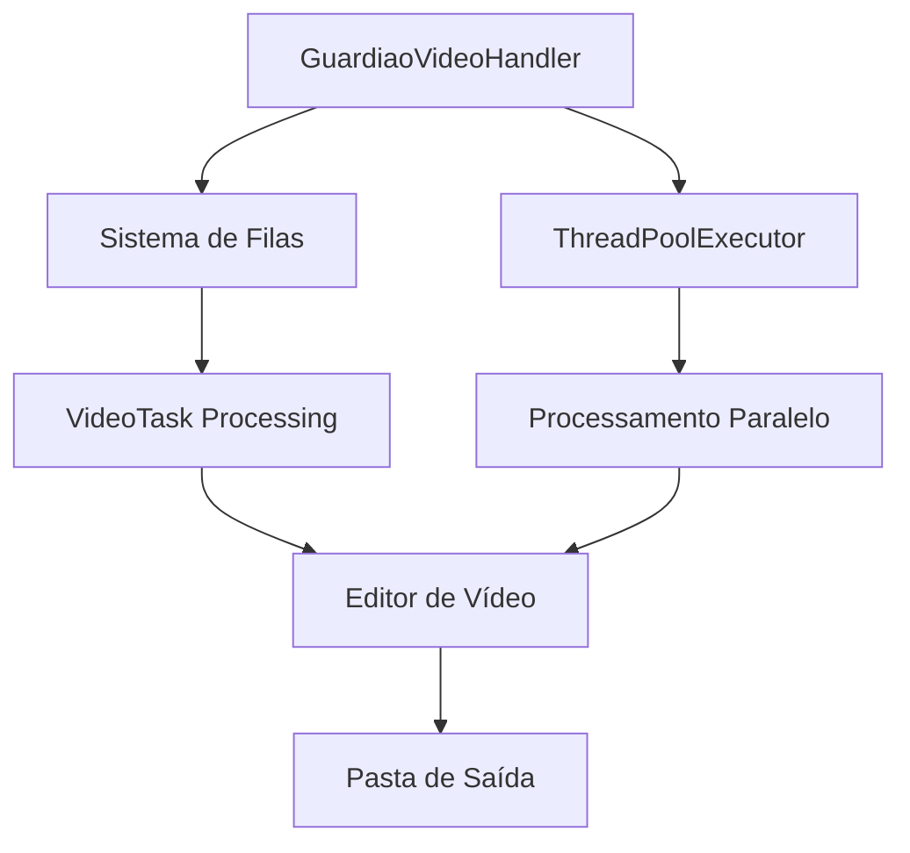
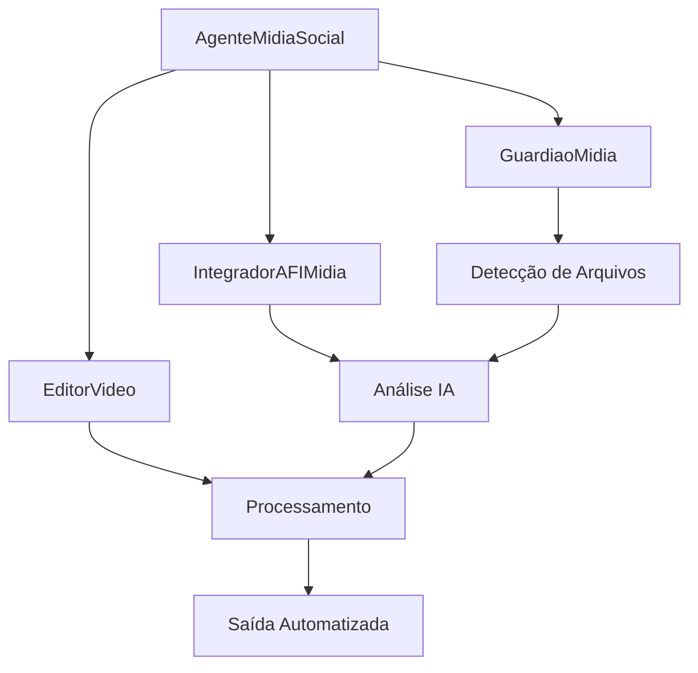
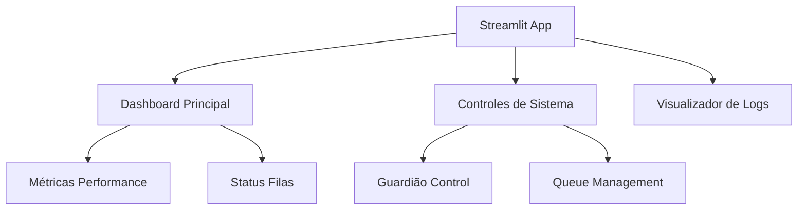
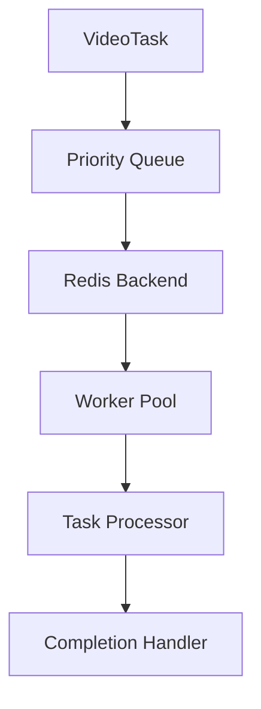
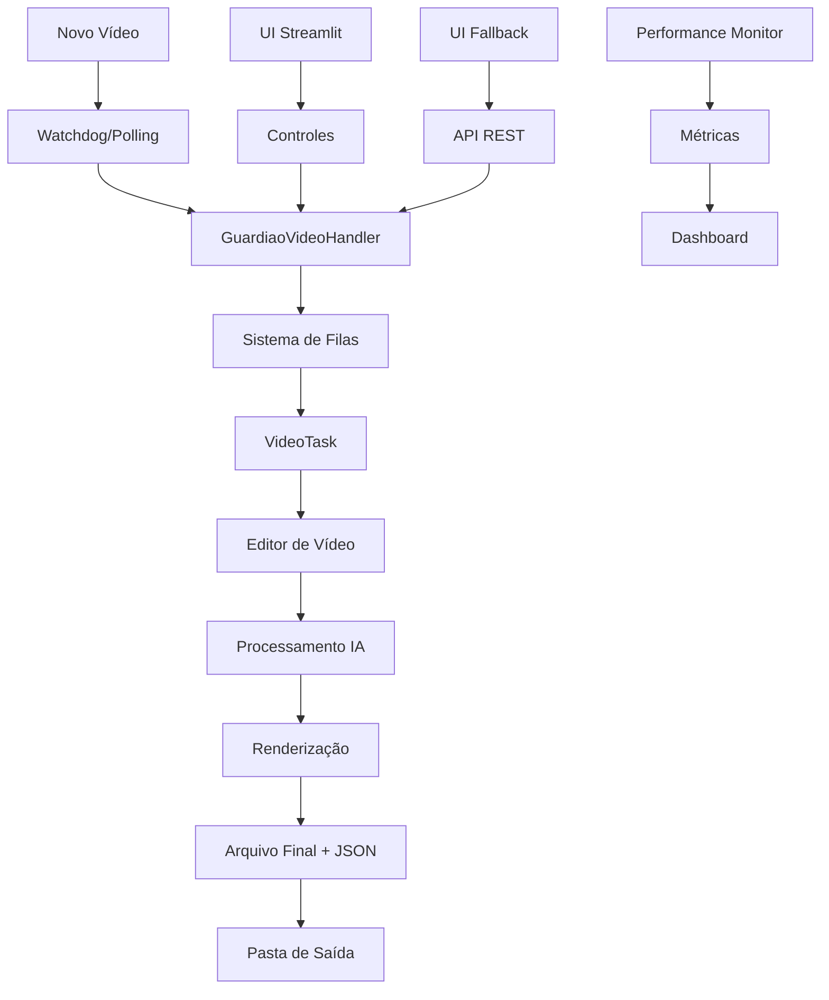

# 🏗️ Arquitetura do Sistema AFI Guardião

## 📋 Visão Geral

O AFI Guardião é um sistema distribuído e modular para processamento autônomo de vídeo, construído com arquitetura orientada a eventos e processamento assíncrono. O sistema combina monitoramento em tempo real, processamento concorrente e interfaces múltiplas para criar um pipeline robusto de automação de mídia.

## 🎯 Princípios Arquiteturais

- **Modularidade**: Componentes independentes e intercambiáveis
- **Escalabilidade**: Processamento paralelo com filas gerenciadas
- **Observabilidade**: Monitoramento completo e métricas em tempo real
- **Resiliência**: Fallbacks automáticos e recuperação de erros
- **Flexibilidade**: Múltiplos modos de operação (simulação/real)

## 🧩 Componentes Principais

### 1. 🛡️ Guardião Principal (`guardiao_v2.py`)

**Responsabilidade**: Coordenador central do sistema de monitoramento e processamento.

#### Funcionalidades Core
- **Monitoramento de Diretórios**: Watchdog + Polling fallback
- **Gestão de Filas**: Integração com sistema de filas Redis
- **Processamento Concorrente**: ThreadPoolExecutor para paralelização
- **Gestão de Estado**: Controle de arquivos processados e em processamento

#### Arquitetura Interna


#### Classes Principais
- **`GuardiaoVideoHandler`**: Handler de eventos do sistema de arquivos
- **`GuardiaoPolling`**: Fallback para monitoramento por polling
- **`VideoTask`**: Representação de tarefas de processamento

#### Configurações
```python
PROCESSING_CONFIG = {
    "workers": 3,                    # Threads paralelas
    "polling_interval": 2,           # Intervalo de polling (segundos)
    "max_retries": 3,               # Tentativas de reprocessamento
    "timeout": 300                   # Timeout por vídeo (segundos)
}
```

### 2. 🎬 Editor de Vídeo (`editor_video.py`)

**Responsabilidade**: Motor de processamento de vídeo com IA integrada.

#### Funcionalidades Core
- **Processamento MoviePy**: Edição programática de vídeo
- **Integração IA**: Análise de conteúdo e geração de metadados
- **Gestão de Assets**: Biblioteca de músicas e recursos
- **Renderização Otimizada**: Configurações adaptativas de qualidade

#### Pipeline de Processamento


#### Modos de Operação
- **Modo Real**: Processamento completo com FFmpeg
- **Modo Simulação**: Geração de arquivos dummy para desenvolvimento

### 3. 🤖 Agente de Mídia Social (`agente_midia_social.py`)

**Responsabilidade**: Orquestrador de alto nível para automação de mídia social.

#### Funcionalidades Core
- **Coordenação de Componentes**: Integra guardião, editor e análise IA
- **Gestão de Workflow**: Controle de fluxo end-to-end
- **Estatísticas e Métricas**: Coleta de dados de performance
- **Interface de Comando**: CLI para operação manual

#### Arquitetura de Integração


### 4. 🌐 Interface Web (`app.py`)

**Responsabilidade**: Interface Streamlit para monitoramento e controle.

#### Funcionalidades Core
- **Dashboard em Tempo Real**: Métricas e status do sistema
- **Controle de Operações**: Start/stop de componentes
- **Visualização de Logs**: Interface para debugging
- **Gestão de Arquivos**: Upload e download de mídia

#### Arquitetura da Interface


### 5. 🔄 UI Fallback (`ui_fallback/`)

**Responsabilidade**: Interface HTML de emergência quando Streamlit não está disponível.

#### Componentes
- **`ui_fallback_server.py`**: Servidor Flask minimalista
- **`index.html`**: Interface responsiva com tema dark

#### Endpoints REST
```python
GET  /api/status        # Status geral do sistema
GET  /api/output        # Lista de arquivos processados
GET  /api/log          # Logs recentes
POST /api/generate_dummy # Forçar geração de dummy
```

#### Características
- **Responsivo**: Design adaptativo para mobile/desktop
- **Tema Dark Neon**: Interface moderna e profissional
- **Auto-refresh**: Atualização automática a cada 2 segundos
- **Ordenação Dinâmica**: Tabelas interativas

## 🔧 Sistemas de Suporte

### 1. 📊 Sistema de Filas (`queue_manager.py`)

**Responsabilidade**: Gerenciamento avançado de filas de processamento.

#### Funcionalidades
- **Filas Prioritárias**: Processamento baseado em prioridade
- **Persistência Redis**: Filas persistentes entre reinicializações
- **Monitoramento**: Métricas de throughput e latência
- **Balanceamento**: Distribuição inteligente de carga

#### Arquitetura


### 2. 📈 Monitor de Performance (`tools/performance_monitor.py`)

**Responsabilidade**: Monitoramento em tempo real de recursos do sistema.

#### Métricas Coletadas
- **CPU**: Utilização por core e média
- **Memória**: RAM, swap e cache
- **I/O**: Leitura/escrita de disco
- **Rede**: Throughput e latência
- **Aplicação**: Filas, tasks e erros

#### Integração
```python
@performance_monitor.track_function
def processar_video(video_path):
    # Função automaticamente monitorada
    pass
```

### 3. 🔍 Sistema de Qualidade (`tools/quality_system.py`)

**Responsabilidade**: Garantia de qualidade de código e conformidade.

#### Ferramentas Integradas
- **Black**: Formatação consistente
- **isort**: Organização de imports
- **Flake8**: Análise estática
- **MyPy**: Verificação de tipos
- **Bandit**: Análise de segurança
- **Pytest**: Testes automatizados

## 🌊 Fluxo de Dados

### Pipeline Principal


### Estados de Processamento
1. **Detectado**: Arquivo identificado pelo guardião
2. **Enfileirado**: Adicionado à fila de processamento
3. **Processando**: Em execução no worker
4. **Renderizando**: Fase de output do vídeo
5. **Concluído**: Arquivo final gerado
6. **Erro**: Falha no processamento

## 🔧 Configuração e Ambiente

### Variáveis de Ambiente Críticas
```bash
# Modo de Operação
GUARDIAN_MODE=simulation|real
DEBUG=true|false
ENVIRONMENT=development|production

# Portas (Regra do Workspace)
UI_PORT=8507              # Interface Web
API_PORT=8508             # API Backend

# Diretórios
GUARDIAN_WATCH_DIRECTORY=./data/Videos_Para_Editar
GUARDIAN_OUTPUT_DIRECTORY=./data/Videos_Agendados
GUARDIAN_TEMP_DIRECTORY=./temp

# Performance
PERFORMANCE_ENABLED=true
QUEUE_ENABLED=true
WORKERS=3
```

### Perfis de Execução
- **Development**: Logs verbosos, modo simulação, hot-reload
- **Production**: Logs otimizados, modo real, performance máxima
- **Testing**: Mocks ativados, dados sintéticos, validações extras

## 🔒 Segurança e Confiabilidade

### Medidas de Segurança
- **Validação de Input**: Sanitização de caminhos e arquivos
- **Análise Estática**: Bandit para detecção de vulnerabilidades
- **Isolamento**: Containers Docker para deployment
- **Logs Auditáveis**: Rastreamento completo de operações

### Estratégias de Confiabilidade
- **Retry Logic**: Reprocessamento automático em falhas
- **Circuit Breaker**: Proteção contra cascata de falhas
- **Health Checks**: Monitoramento de saúde dos componentes
- **Graceful Shutdown**: Finalização segura de processos

## 📊 Observabilidade

### Logging Estruturado
```python
logger.info("Video processing started", extra={
    "video_path": video_path,
    "task_id": task.id,
    "priority": task.priority,
    "worker_id": worker.id
})
```

### Métricas Prometheus
- `afi_videos_processed_total`: Total de vídeos processados
- `afi_processing_duration_seconds`: Tempo de processamento
- `afi_queue_size`: Tamanho atual das filas
- `afi_error_rate`: Taxa de erro por minuto

### Dashboards Grafana
- **Visão Geral**: Status geral do sistema
- **Performance**: CPU, memória, I/O
- **Aplicação**: Throughput, latência, erros
- **Infraestrutura**: Docker, Redis, storage

## 🚀 Escalabilidade

### Estratégias de Escala
- **Horizontal**: Múltiplas instâncias do guardião
- **Vertical**: Aumento de workers por instância
- **Distribuída**: Redis cluster para filas
- **Cloud**: Deployment em Kubernetes

### Limites Atuais
- **Workers**: 3-8 threads por instância
- **Memória**: ~2GB por worker ativo
- **Storage**: Dependente do volume de vídeos
- **Rede**: Limitado pela largura de banda local

## 🔄 Evolução da Arquitetura

### Roadmap Técnico
1. **Microserviços**: Separação em serviços independentes
2. **Event Sourcing**: Histórico completo de eventos
3. **CQRS**: Separação de comandos e consultas
4. **ML Pipeline**: Integração com modelos de machine learning
5. **Real-time Streaming**: Processamento de vídeo em tempo real

### Considerações Futuras
- **Kubernetes**: Orquestração nativa
- **gRPC**: Comunicação inter-serviços
- **Apache Kafka**: Event streaming
- **TensorFlow Serving**: Modelos ML em produção