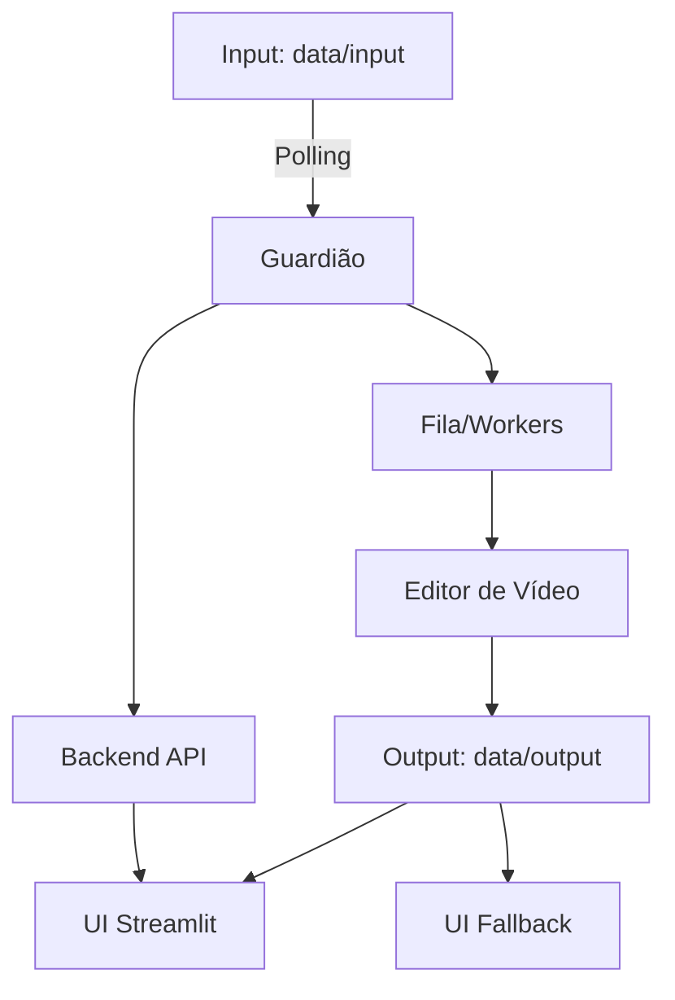

# 🛠️ AFI Guardião — Guia do Desenvolvedor (Dev Guide)

Este handbook consolida o setup local e Docker, a estrutura do projeto, o fluxo de contribuição (CI/CD), troubleshooting e boas práticas, além do ciclo operacional Guardião → Editor → UI.

---

## 🚀 Setup Local

### Pré-requisitos
- Python 3.10+
- Git
- FFmpeg instalado e no `PATH`
- (Opcional) Ollama em `http://localhost:11434` para IA

### Instalação
```bash
# 1) Criar e ativar venv (Windows)
python -m venv .venv
.\.venv\Scripts\activate

# 1) Criar e ativar venv (Linux/macOS)
python3 -m venv .venv
source .venv/bin/activate

# 2) Instalar dependências
pip install -r requirements.txt

# 3) Copiar variáveis de ambiente
copy .env.example .env   # Windows
cp .env.example .env     # Linux/macOS
```

### Variáveis principais
```dotenv
AFI_PORT=8507
AFI_BACKEND_PORT=8508
AFI_INPUT_DIR=./data/input
AFI_OUTPUT_DIR=./data/output
AFI_LOG_DIR=./logs
AFI_WORKERS=2
POLLING_INTERVAL=2
NO_DEPS=0
DEBUG_MODE=false
```

### Rodando a UI
```bash
# Detecta Streamlit e faz fallback automaticamente
scripts/run_ui.bat            # Windows
scripts/run_ui.sh             # Linux/macOS

# Manual (Streamlit)
py -m streamlit run app.py --server.port 8507 --server.headless true

# Manual (Fallback UI)
python ui_fallback/ui_fallback_server.py --port 8507
```

### Rodando o Guardião e Perfis
```bash
# Perfis prontos
scripts/run_profile_sim.bat   # Simulado (NO_DEPS=1)
scripts/run_profile_real.bat  # Real (NO_DEPS=0)

# Guardião direto
scripts/run_guardian.bat
scripts/run_guardian.sh
```

---

## 🐳 Setup com Docker

### Compose
```bash
docker compose up -d            # Sobe serviços: guardião, redis, prometheus, grafana
docker compose logs -f          # Acompanha logs
```

### Build da imagem
```bash
docker build -t afi-guardiao .
docker run -p 8507:8507 -p 8508:8508 \
  -v %cd%/data:/app/data -v %cd%/logs:/app/logs afi-guardiao
```

### Portas e Serviços
- Frontend Streamlit: `8507`
- Backend Flask: `8508`
- Redis: `6379`
- Prometheus: `9090`
- Grafana: `3000`

### Volumes sugeridos
- `./data/input`, `./data/output`, `./data/processed`
- `./logs`, `./reports`

---

## 🗂️ Estrutura do Projeto

Principais diretórios e arquivos:
- `app.py`: UI Streamlit (Chat, Painel, Conhecimento, Estúdio)
- `guardiao_v2.py`: Orquestrador de produção de vídeos (polling, jobs)
- `editor_video.py`: Pipeline de edição/geração de vídeos
- `agente_midia_social.py` e `guardiao_midia.py`: Integração com mídia social
- `backend_api.py`: API Flask (status, pastas monitoradas)
- `ui_fallback/`: Servidor HTTP minimalista + `index.html`
- `environment.py` e `config.py`: Configurações e carregamento de variáveis
- `data/`: Entrada, saída, processados, músicas
- `docs/`: `architecture.md`, `api.md`, `dev_guide.md`
- `tests/`: Testes unitários e integração
- `tools/`: Qualidade, performance, queue monitor
- `scripts/`: Execução, perfis, testes, setup dev

---

## 🔄 Ciclo Guardião → Editor → UI

### Visão do fluxo


### Descrição
- Guardião monitora `data/input` e cria tarefas
- Editor processa vídeos (cortes, legendas, música, exportação)
- Saída é escrita em `data/output`
- UI Streamlit e UI Fallback exibem estado, arquivos e logs
- Backend API fornece endpoints para status e folders

---

## 🤝 Fluxo de Contribuição e CI/CD

### Branches e PRs
- Crie branches por feature: `feat/nome-feature`
- Use mensagens de commit no padrão Conventional Commits
- Abra PRs com descrição, checklist e testes

### Commits (exemplos)
- `docs: add architecture and API advanced documentation`
- `feat(editor): add auto-captioning step`
- `fix(guardiao): handle missing input gracefully`

### Hooks e Qualidade
```bash
# Instalar hooks de pré-commit
scripts/pre_commit.bat

# Formatadores/linters
scripts/format_code.bat
scripts/check_quality.bat
```

### Testes
```bash
# Simulados (sem deps pesadas)
scripts/test_all_sim.bat
scripts/test_all_sim.sh

# Reais
scripts/test_all_real.bat
scripts/test_all_real.sh
```

### Pipelines CI/CD (GitHub Actions)
- `ci.yml`: lint, testes, build
- `release.yml`: empacotamento e publicação
- `dependabot-auto-merge.yml`: merge automatizado de atualizações seguras

---

## 🧩 Troubleshooting

### Problemas comuns
- Streamlit não encontrado: use `scripts/run_ui.bat` (fallback automático)
- FFmpeg ausente: instale e configure `PATH`
- Porta ocupada: ajuste `AFI_PORT`/`AFI_BACKEND_PORT` no `.env`
- Erro no push para `main`: branch local padrão é `master`; use `git push origin master`
- CRLF/LF avisos: configure `git config core.autocrlf true` no Windows
- Ollama indisponível: o sistema funciona sem IA avançada (RAG é opcional)

### Logs e diagnóstico
- `logs/` para arquivos de log
- UI Fallback: `GET /api/log` e `GET /api/status`
- Monitor de performance: `tools/performance_monitor.py`

### Boas práticas
- Pequenos commits, mensagens claras
- Rodar testes antes de PR
- Manter `.env` atualizado e não commitar segredos
- Usar scripts prontos para consistência

---

## 🔧 Cheatsheet de Comandos

```bash
# UI
scripts/run_ui.bat
scripts/run_ui.sh

# Perfis
scripts/run_profile_sim.bat
scripts/run_profile_real.bat

# Guardião
scripts/run_guardian.bat
scripts/run_guardian.sh

# Testes
scripts/test_all_sim.bat
scripts/test_all_real.bat

# Qualidade
scripts/format_code.bat
scripts/check_quality.bat

# Dev setup
scripts/setup_dev.bat
```

---

## 📡 Endpoints resumidos

### Backend (8508)
- `GET /` — health check
- `GET /api/status` — status geral
- `GET /api/folders` — pastas monitoradas

### UI Fallback (8507)
- `GET /api/status` — status
- `GET /api/output` — arquivos processados
- `GET /api/log` — logs recentes
- `POST /api/generate_dummy` — gerar dummy

---

## 📚 Referências
- `docs/architecture.md` — Arquitetura completa
- `docs/api.md` — Endpoints e integrações
- `README.md` — Instalação rápida e uso

---

## ✅ Checklist para novos contribuidores
- Instalou dependências e configurou `.env`
- Rodou `scripts/run_ui.bat` e verificou UI
- Executou `scripts/test_all_sim.bat`
- Criou branch `feat/...` e seguiu Conventional Commits
- Abriu PR com descrição, testes e checklist